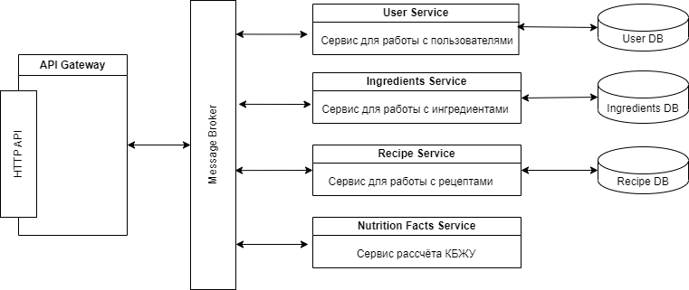

В проекте используется микросервисная архитектура в соответствии со схемой

# Описание микросервисов

## User service

Сервис отвечает за работу с данными о пользователях, а также аутентификацию.

Предоставляемые функции:
- регистрация пользователя
- аутентификация пользователя
- получение данных о пользователе

## Ingredients service

Сервис отвечает за работу с данными об ингредиентах.

## Recipe service

Сервис отвечает за работу с рецептами.

## Nutrition facts service

Сервис предназначен для рассчёта пищевой ценности.

## API gateway

Предоставляет единый HTTP API для сервисов, отвечает за авторизацию запросов. 